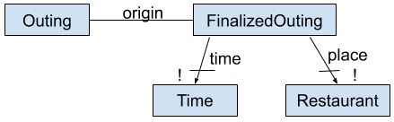

# ChAJA Conceptual Sketch

Members: aprilxie, animrick, himawan, pham2ez

## What problem does the project address? Why does it matter?

If you’ve ever tried to coordinate anything between a group of people before, you know
how hard it is. For example, if just having to coordinate the timing for a lunch meetup turns out
to be difficult, imagine how much harder it is with the added responsibility of finding a restaurant
that everyone can agree on with their current dietary restrictions. One group member usually
has to collect the relevant information from group members and then propose a restaurant
based on that information.

We want to make this process less stressful by giving groups a platform where all group
members are more closely involved in the entire process (evenly spreading responsibility) and in
which some of the decision process is alleviated with the platform proposing restaurants based
off of people’s preferences, allergies, etc.

It is important for people to maintain relationships, between close friends as well as
within a work environment, and food is often essential to socialization and connection. However,
with the way things currently are, finding a suitable time and place to eat requires a lot of
activation energy. With the existence of our project, it will be lowered substantially. People will
worry less about how they are going to organize an outing and focus more on looking forward to
the occasion.

## How will the app work? (key concepts, purpose, structure, and behavior)

### Outing

**Purpose**:​ facilitate a selection of time and place for a group of people to share a meal

**Structure**:  

**Actions**:  
*create(u: User)*: User u creates an outing and becomes the organizer  
*join(u: User)*: User u joins an outing  
*leave(u: User)*: User u leaves an outing  
*cancel(u: User)*: User u (organizer) cancels the outing  
*designate(o: User, a: User)*: User o (organizer) designates User a as the new organizer

 

**Tactic**:

* When a user creates an outing, other users may join the outing (as well as leave afterwards)
* If the organizer leaves the outing without designating a new organizer, the outing is canceled

### Preference

**Purpose**:​ allow users to modify filtering or sorting of restaurants for their outing

**Structure**:  

**Actions/Tactic**:  
*specify(u: User, p: Preference)*: create Preference p for User u; for all restaurants in the outing, if the restaurant doesn’t satisfy p, then remove it from the restaurants in the outing  
*remove(u: User, p: Preference)*: remove Preference p for User u: inverse of specify

### Suggestion

**Purpose**:​ to prioritize restaurants that users specify

**Structure**:  

**Actions/Tactic**:  
*create(u: User, r: Restaurant)*: User u suggests Restaurant r; if r not in outing restaurants, add it
to the set  
*remove(u: User, r: Restaurant)*: User u removes suggestion of Restaurant r; inverse of create

### Finalize

**Purpose**:​ prevent further modification of an outing

**Structure**:  

**Actions**:  
*finalize(User u: Outing o)*: User u (organizer) finalizes the outing  
*cancel(User u: Outing o)*: User u (organizer) cancels the finalization

 

**Tactic**:  
* If finalize an outing, no one can adjust availability or suggest restaurants (but can join/leave)
* If cancel, attendees can adjust availability, suggest restaurants; any availability info or suggestions should be the same as they were before finalizing

### Approve

**Purpose**:​ allow users to vote on whether they think a restaurant is acceptable

**Structure**:  

**Actions**:  
*approve(User u: Restaurant r)*: User u approves Restaurant r  
*unapprove(User u: Restaurant r)*: User removes approval of Restaurant r

**Tactic**:
 * If user approves a restaurant, the organizer can see the approval

### Availability

**Purpose**:​ to find a time for people to meet, as well as determine possible restaurants to eat at

**Structure**:  

**Actions**:  
*addTime(User u: Time t)*: User u adds Time t to their availability  
*removeTime(User u: Time t)*: User u removes Time t from their availability

**Tactic**:
 * If you add a time, that indicates that you are available during that time, and the organizer can take your availability into account and restaurants whose open hours are not compatible with the availability of the group are removed

## Why is the project interesting? How is the conceptual design work substantive?

The project proposes a platform for organizing group restaurant outings. There are a lot of variables that go into choosing a time and place for food with friends, especially given busy schedules, dietary restrictions, and differing food preferences. Our project aims to help users narrow down their choices when planning such an outing and to streamline the decision making process.

Our group organization tool is based on the concept of an “outing”, which allows users to list their restaurant preferences and scheduling availability. The tool then automatically generates a list of suggested times and restaurants based on the collective preferences of all users. A “suggestion” is something that can be “approved” by any user in the outing and users may suggest their own restaurants to the group, in addition to those that are automatically generated. Once users have browsed suggested times and locales, the organizer can see the opinions of the group and make a decision, or he or she can ask the application to choose an optimal place or time based on user approval.

We believe there are several worthwhile conceptual ideas and design challenges in this project. Many restaurant search and recommendation applications exist, but we have not encountered any that facilitate group restaurant events. Our concept of a group outing and the individual preferences that must be considered to plan one are more similar to how the organization of group events often goes (we think it’s much more useful for friends to be able to discuss and compile individual food preferences and needs than it is to discuss restaurants based solely on ratings and reviews as are found on most other restaurant finding applications).

In order to implement this idea, we will need to develop our own system of criteria and a matching algorithm based on those criteria. As part of generating suggested restaurants, we’d also like to implement a way of prioritizing restaurants that are located in a mutually convenient location for each user involved in an outing. Time permitting, we have also discussed implementing some way of facilitating payment (which is often a hassle when a group eats out together). This would likely consist of a way for users to log what they each ate at the restaurant, decide whether to split the bill evenly or have each person pay for what they personally ordered, and then calculate the amount each person owes. These challenges go beyond CRUD operations and if implemented well, should make ease the process of choosing a place to eat with friends.