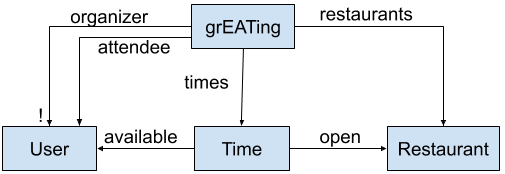
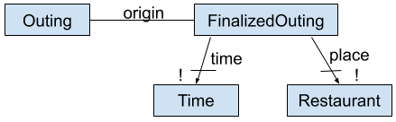
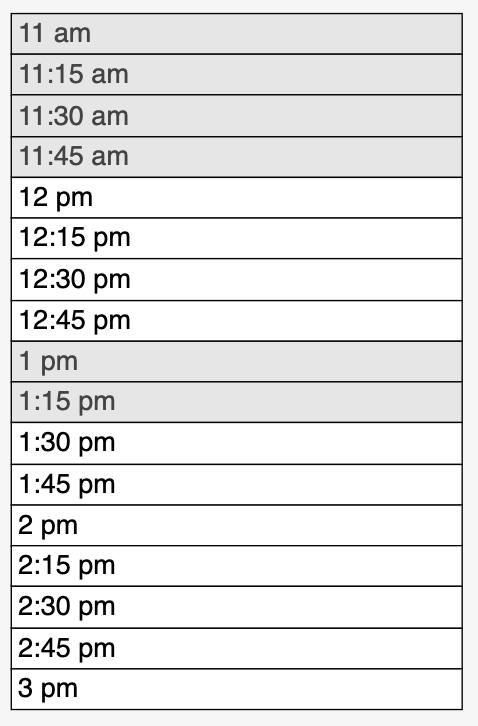

# Full Design
## Overview
We plan to build grEAT, a tool which will help people organize meals with friends. Food is often critical to social interaction and maintaining healthy relationships with others, but it can be very difficult to organize an outing. We believe that the two primary challenges that a group of friends face while trying to organize a group meal are finding times and places that work for everyone’s busy schedules and dietary restrictions. Thus, grEAT’s main purposes are to provide a scheduling tool and a restaurant selection tool.

### Scheduling

grEAT will have a scheduling tool, which allows everyone to input their availabilities and provide this information to the grEAT organizer, who can then finalize a time (or ask grEAT to choose a time at random). 

### Restaurant Selection

grEAT will also have a restaurant selection tool, which generates a list of suggestions based on everyone’s dietary restrictions, food cravings, distances, and schedules (which are compared to the restaurants’ opening hours); users are allowed to contribute their own suggestions to this list and approve any restaurants that they would be willing to eat at; the organizer can easily finalize the restaurant based on all of this information (or ask grEAT to choose a time at random).

We were unable to find any systems which offered similar capabilities. It’s possible that no one has thought to create such a system, since it’s entirely possible to schedule a group outing through a group chat. It’s also possible that a similar system was invented, but then was not proven to be simpler to use than a group chat.

## Conceptual Design

### grEATing

**Purpose**:​ facilitate a selection of time and place for a group of people to share a meal

**Structure**:  

**Actions**:  
- *create(u: User)*: User u creates a grEATing and becomes the organizer  
- *join(u: User, g: grEATing)*: User u joins grEATing g  
- *leave(u: User, g: grEATing)*: User u leaves grEATing g  
- *cancel(u: User, g: grEATing)*: User u (organizer) cancels grEATing g  
- *designate(o: User, a: User, g: grEATing)*: User o (organizer) designates User a as the new organizer of grEATing g

**Tactic**:
- When a user creates an grEATing, other users may join the grEATing (as well as leave afterwards)
- The user who created a grEATing is the organizer of that grEATing unless otherwise specified, even if that user leaves

### Preference
**Purpose**: allow users to modify filtering or sorting of restaurants for their grEATing

**Structure**:  

**Actions**:  
- *specify(u: User, p: Preference)*: create Preference p for User u; displayed restaurants remain the same, but order changes  
- *remove(u: User, p: Preference)*: remove Preference p for User u; displayed restaurants remain the same, but order changes

**Tactic**:
- If a user adds/removes a preference, the list of suggested restaurants are re-weighted based on all users’ preferences, and shown in order of satisfaction

**Clarification**:
- We decided that adding/removing preferences shouldn’t add or remove potential restaurant options, since restaurants that users approved shouldn’t just disappear

### Suggestion

**Purpose**:​ to prioritize restaurants that users specify

**Structure**:  

**Actions**:  
- *create(u: User, r: Restaurant)*: User u suggests Restaurant r; if r not in grEATing restaurants, add it
to the set  
- *remove(u: User, r: Restaurant)*: User u removes suggestion of Restaurant r; inverse of create

**Tactic**:
- A user who doesn’t see a restaurant they like in the list of auto-generated restaurants (based on dietary restrictions & preferences), or really wants to go to a particular restaurant, can suggest that restaurant; it gets added to the top of the restaurant list

### Finalize

**Purpose**:​ prevent further modification of a grEATing

**Structure**:  

**Actions**:  
- *finalize(User u: grEATing g)*: User u (organizer) finalizes the grEATing  
- *cancel(User u: grEATing g)*: User u (organizer) cancels the finalization

**Tactic**:  
- If finalize a grEATing, no one can adjust availability or suggest restaurants (but can join/leave)
- If cancel, attendees can adjust availability, suggest restaurants; any availability info or suggestions should be the same as they were before finalizing

### Approve

**Purpose**:​ allow users to vote on whether they think a restaurant is acceptable

**Structure**:  

**Actions**:  
- *approve(User u: Restaurant r)*: User u approves Restaurant r  
- *unapprove(User u: Restaurant r)*: User removes approval of Restaurant r

**Tactic**:
- Users can see the number of approvals on each restaurant
- Based on number of approvals, the organizer can get a better idea of which restaurants would be a good option to eat at

**Clarification**:
- Approval is for what restaurants users would be willing to eat at; therefore, if someone doesn’t approve of any, the assumption is that they don’t like any of the options. It’s also possible that they just haven’t gotten to the approval step yet, so the organizer can either set an approval deadline, or reach out to individuals who haven’t approved for clarification.

### Availability

**Purpose**:​ to find a time for people to meet, as well as determine possible restaurants to eat at

**Structure**:  

**Actions**:  
- *addTime(User u: Time t)*: User u adds Time t to their availability  
- *removeTime(User u: Time t)*: User u removes Time t from their availability

**Tactic**:
 - If you add a time, that indicates that you are available during that time, and the organizer can take your availability into account and restaurants whose open hours are not compatible with the availability of the group are removed

## Wireframes
Moqups link: https://app.moqups.com/3JlVZl9Ba0/view

### Comments:
The ability to browse restaurants is a functionality that is available to both a non-user and user, but in this case, the browsing assumes the user state. If a non-user browses, the suggest button would not appear and the header would only have the Sign In and Sign Up buttons.

Past grEATings will look similar to My grEATings, but the status will be Past instead and possibly greyed out.

grEATings will also be sorted by recency, so in reality, ChAJA Lunch would appear before CS Dinner.

Colored buttons show that these are the only buttons that are available to the organizer and not to other members. So ChAJA Lunch is one where Jenna is the organizer and CS Dinner is one where Jenna is not.

Suggestions include restaurants that fulfill the initial cravings of all of the users and then restaurant suggestions made by users are added in addition to the ones populated by the website.

The calendar will ideally indicate which days the organizer has picked out, in this case from 12/2/19 to 12/9/19, by greying them out and the black box indicates which day the user is inputting their availability for.

There will be another timeblock added that specifically shows everyone’s ideal time, not just the one the user inputs.

Currently, only one timeblock exists for user to input for ChAJA Lunch:  

Schedule Settings button allows the organizer to change the date range as well as the ideal duration of the grEATing and add days to the calendar for users to fill out.

A finalized grEATing will not allow the user to input anything else.

There will be more than 2 dietary restrictions added.

### Explanations:
The searching ability for the User Home page is for grEATings and that will include filters such as searching by the grEATing name and filtering grEATings for specific users (by username and first name).

My Cravings button allows users to choose from the tags available so that the website can take it into consideration for choosing restaurants. The restaurant suggestions list is constantly changing and users will receive an in-website notification (like Facebook) about changes made such as a new user has joined, when the suggestions list changes, when the organizer has changed a setting, etc. The in-website notifications will appear from the placeholder in the header at all times when the user is logged in, like it does on the grEATing View Owner page.

## Design Commentary
Below is an outline of major design choices we discussed as we developed our idea. These decisions are sectioned by where in the process of using the application a user encounters these behaviors.

### Account Creation
- Without an account, users can only browse restaurants.
  - We don’t want to force users to create an account in order to access ALL content of our application. However, it is impractical to allow users without stored information to create or join grEATings. How would an anonymous user change the preferences associated with their grEATing, for example? We decided that anyone can browse our database of restaurant information, access menus, and filter restaurants by preference tags, but only users with accounts may join or create grEATings.

 - A zipcode is required to create an account. Addresses are optional.
   - Each grEATing will search for restaurants within a certain distance from every participant’s location. Consequently, we need to have some basic information about where a user is located. We decided user’s will enter a zip code when they create an account, to be used as a default location in all grEATings. Users may also optionally store one or more street addresses with their profile, which they can then choose to apply for any grEATing. Alternatively, a user could enter a new temporary address, to be used only by a single grEATing, and then discarded. We did not want to force users to store a street address, which may be considered personal information.

 - Some preferences (like dietary restrictions) are stored in the user profile.
   - A “grEATing” generates a list of suggested restaurants based on the “preferences” of all participating users. We recognized that some preferences are more constant than others. For example, dietary restrictions are unlikely to change between group outings (a user who is gluten free is always going to be gluten free), but other preferences (like desired type of cuisine) are variable and may change from outing to outing. To handle this, we decided that certain types of preferences (particularly dietary restrictions) will be asked for at the time of account creation, stored with the user’s account, and applied to each grEATing. Most preferences, however, will be unique to each grEATing and entered by the user when he/she joins a grEATing. Having two genres of preferences prevents users from tediously needing to enter that they’re vegan for every grEATing, but still allows for flexibility between outings with respect to other preferences.

 - Users are not informed about grEATs which they are not invited to.
    - Many platforms which incorporate the concept of “user” also include the concept of a “user page”, which displays information about a given user and that user’s activity. However, we believe that the grEATing history of User A that is displayed for User B should only contain grEATings which both users were a part of. We believe that this is respectful of user privacy—User A might not want User B to know where User A has been and with whom. Furthermore, we believe that this choice decreases that chance that User B feels that left out of some of User A’s past grEATings; by extension, this increases User A’s freedom to choose whom to eat with.

### Creating/Joining a grEATing
- The organizer of a grEAT need not be eating with the group.
  - We had decided that one user, an “organizer” creates a grEAT and invites all participating users to join. We then realized that there are many cases in which an organizer may not have any intention of joining the group for the meal. For example, a secretary or assistant may schedule a corporate lunch and not plan to be in attendance themselves. In this case the organizer’s personal preferences should not be taken into account when suggesting restaurants for the group. Consequently, we decided that an organizer, upon creating a grEATing, will be asked whether they intend to join the group to eat. If the organizer says no, his/her preferences will be ignored when generating suggestions. The organizer should be able to easily change this at any time while the grEATing is still active. If the organizer later decides to join, new suggestions will be generated, taking his/her preferences into account.

 - A participant may invite users to a grEATing, but those users must accept the invitation.
   - We intend for any user to be discoverable by an organizer when creating a grEATing, so that organizers can easily invite their friends (but the invited user’s information will not be displayed to the organizer). This makes invitation sending easier but also allows for strangers to invite random people to grEATings. To mitigate this, a user always has the option of accepting or declining an invitation before they are added to the grEATing.

 - Each grEATing has an associated link which allows users to join.
   - We believe that grEATings are likely to be created for large groups of people who already know each other. “Link sharing” would allow a user to send a link via email or group chat to their friends, which would save them a lot of time searching for and inviting users one-by-one. It is possible that the link could be subsequently shared by its recipients, thus inviting more (possibly unwelcome) people to the grEATing. However, since any user is already allowed to add additional users through the user search mechanism, we believe that sharing an invite link with someone requires only a bit more trust in them than inviting them to the grEATing directly. Furthermore, we have decided that a grEATing organizer has the ability to remove people from the grEATing; thus, anyone who is not actually welcome could be removed before the grEATing is finalized.

### Generating Suggestions
 - Organizers may set an approval deadline
   - There was some question as to whether users should have a limited amount of time to approve restaurant suggestions, or whether they should have a deadline (to ensure enough information is collected in a timely manner). We considered setting some kind of default deadline (maybe approval should close 24 hours before the desired eating time?). However, we didn’t want users to have to select a time before selecting a restaurant. In order to keep the application flexible, we want to enable organizers to choose a time and restaurant in any order, or simultaneously. So instead we decided that by default, users may continue to approve suggestions for an indefinite period of time, until the organizer selects a restaurant for the group (at which point approval will close). However, an organizer may elect to impose an approval deadline when creating the grEATing, in which case approval will close after that.

 - Bad Suggestions will be flagged
   - We’ve made some distinction between invariable user preferences (like dietary restrictions stored in their profile) and variable preferences (like craving a certain cuisine). We will have our system suggest only restaurants that meet everyone’s invariable preferences (if someone is vegan, restaurants without vegan options will not be suggested at all. However, when handling some of the softer, more variable preferences specific to a particular grEATing, the system will simply try to suggest restaurants that best fit those criteria overall (because there may be so many preferences that it can’t find any restaurant to meet all of them). Since the system is discarding “bad” suggestions, we had to decide whether it should also reject manual user suggestions that don’t meet everyone’s dietary restrictions. We decided that the system should still allow a user to manually make a “bad” suggestion, but the user will be notified that the suggestion violates a person’s dietary restrictions and will have to accept if they’d like to go forth with the suggestion. That suggestion will then have a note attached to it when displayed alongside all other suggestions to be approved. It’s then at the discretion of participating users whether to approve it and at the organizer’s discretion whether to choose it, given this information. We did this for the sake of providing participants with as much information as possible without limiting their choices. 

## Social/Ethical Reflection
### Stakeholders
Besides impacting its direct users, grEATing’s stakeholders also include restaurants, users’ friends who don’t use the app, and other scheduling and messaging platforms. 

### Local Restaurant Discovery
Part of grEAT’s functionality is restaurant search, similar to Yelp; one of the main social/ethical issues that can arise from this is the impact on the local restaurant business. Especially since we are using an external API to pull restaurant data, smaller, lesser-known restaurants might be at a disadvantage, since they are less likely to be recommended or discovered on grEAT. This could drive business toward restaurants that already have a reputation, and force newer restaurants to either be active on social media or develop some kind of online presence in order to stay in business. Because of this, we will try as much as possible to maximize our range of restaurants. If we were to continue developing grEAT, another functionality we would look into to alleviate this issue is a “restaurant management” interface that allows restaurants to claim a business and potentially add themselves to our platform.

### Being Sensitive to Dietary Needs and Preferences
A major premise of grEAT is to prioritize users’ individual dietary needs and preferences, since most restaurant search apps don’t include this functionality. We know that when friends plan outings, there is often one person who may have a dietary restriction that becomes forgotten, or acknowledged at the last minute; as a result, the restaurant they go to often has few or no options that cater to their needs. To make sure that restaurant choices are fair and inclusive to everyone in the group, we decided to allow users to specify dietary restrictions in their profile, and any grEAT that they are a part of will only display restaurants that satisfy their needs.

### Encouraging Inclusion
Another decision we made is to allow users to send an invite link to their friends to join a grEAT, even if they don’t have an account. Our hope is that this will make grEAT more inclusive and encourage users to invite friends outside the grEAT platform (although they will still need to make a grEAT account upon invitation). 

### User Privacy
In our design of grEAT, we have tried to allow users to maintain as much privacy as possible. Users are only required to input a zip code (rather than an address or precise location) when using grEAT. Additionally, as discussed in the design decisions section, we decided that users should not be able to learn about grEATings which they were not a part of. This means that each user is free to meet up with others as they please and be certain that no one else will know whom they have met up with. Furthermore, this prevents users from learning about the past or future whereabouts of others.

### Avoiding Jealousy & Social Pressure
By preventing users from learning about grEATings that they were not a part of, we decrease the likelihood that someone feels unwelcome, jealous, or left out. We also aim to reduce social pressure in the restaurant approval process by only showing how many users have approved a certain restaurant—we believe the names of the users who have approved thus far to be irrelevant to the maximization of group happiness, and we also believe that users are more likely to express their true opinions when they have some degree of anonymity. 

